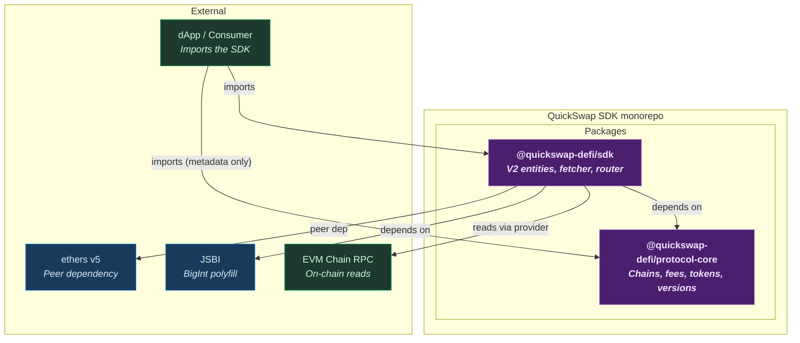

<p align="center">
  <strong>QuickSwap SDK</strong><br>
  <em>TypeScript building blocks for QuickSwap V2 trading and multi-chain protocol metadata.</em>
</p>

<p align="center">
  <a href="docs/overview.md">Overview</a> &bull;
  <a href="#packages">Packages</a> &bull;
  <a href="docs/flows/">Flows</a> &bull;
  <a href="docs/glossary.md">Glossary</a> &bull;
  <a href="docs/adr/">ADRs</a>
</p>

---

> Trade entities, pricing math, and chain configuration — published as two focused npm packages.

A pnpm monorepo with two packages: `@quickswap-defi/protocol-core` (chain registry, versions,
stablecoins, fees) and `@quickswap-defi/sdk` (Uniswap V2-fork entities, fetcher, router).
Consumers pick metadata only, or the full trading toolkit on top of it.

## Packages

| Package | Role | Status |
|---|---|---|
| [`@quickswap-defi/protocol-core`](packages/protocol-core/) | Chain configs, protocol versions, fees, native + stablecoin metadata | Published |
| [`@quickswap-defi/sdk`](packages/sdk/) | V2 entities (`Token`, `Pair`, `Route`, `Trade`), fetcher, router | Published |

## Architecture



## How It Works

1. **Resolve chain metadata** — read chain config and addresses from `protocol-core`.
2. **Build entities** — instantiate `Token`s, fetch `Pair` reserves, construct a `Route`.
3. **Compute the trade** — derive `Trade` outputs, slippage bounds, and execution params.

Full sequence → [docs/flows/trade-execution.md](docs/flows/trade-execution.md).

## Install

```bash
pnpm add @quickswap-defi/sdk @quickswap-defi/protocol-core
pnpm add @ethersproject/address @ethersproject/contracts @ethersproject/providers @ethersproject/networks @ethersproject/solidity
```

## Stack

| Component | Purpose |
|---|---|
| TypeScript 5 (strict) | Source language |
| tsup | CJS + ESM dual build with `.d.ts` |
| Vitest 2 | Test runner |
| ESLint 9 | Lint (flat config) |
| JSBI | BigInt math |
| ethers v5 | Peer dependency for on-chain reads |

## Documentation

Documentation follows [Diátaxis](https://diataxis.fr/) — each doc stays in its lane.

| Doc | Type | Description |
|-----|------|-------------|
| [Overview](docs/overview.md) | Explanation | What the SDK is and why the split exists |
| [Packages](#packages) | Reference | Per-package READMEs (also published to npm) |
| [Flows](docs/flows/) | Explanation | Trade execution and chain onboarding |
| [Glossary](docs/glossary.md) | Reference | Domain terms |
| [ADRs](docs/adr/) | Decisions | Architecture decision records |

## Development

```bash
pnpm install
pnpm -r build
pnpm -r test
pnpm -r lint
```

## License

MIT.
