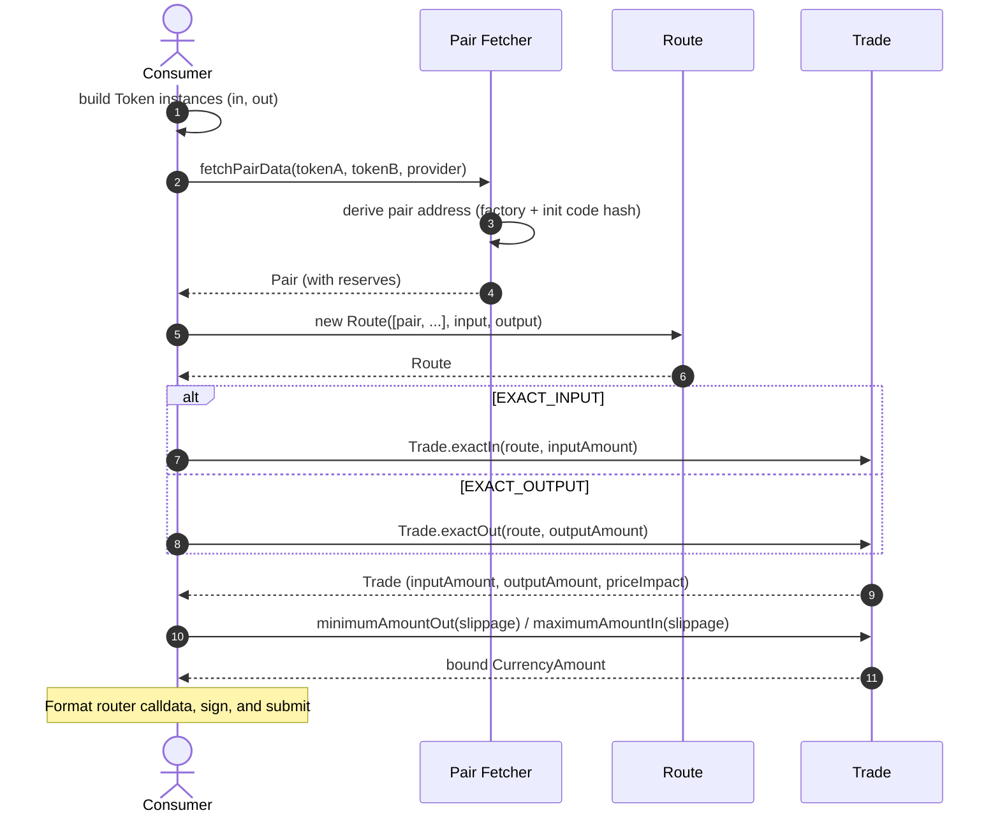

# Flow — Trade execution

How a consumer turns input amounts into a `Trade` with the params needed to execute on-chain.

## Sequence

## Steps

1. **Consumer** builds `Token` instances for the input and output currencies. Each `Token`
   carries its chain id, address, and decimals.
2. **Consumer** asks the **Fetcher** for the `Pair` between the two tokens. The fetcher derives
   the pair address (factory + init code hash) and reads reserves from chain via the ethers
   provider.
3. **Consumer** constructs a **Route** from the input currency through one or more pairs to the
   output currency. Single-hop routes use one pair; multi-hop routes chain pairs together.
4. **Consumer** instantiates a **Trade**:
   - `Trade.exactIn(route, inputAmount)` — fix the input, derive the output.
   - `Trade.exactOut(route, outputAmount)` — fix the output, derive the input.
5. **Consumer** picks a slippage `Percent` and reads the bounds:
   - `trade.minimumAmountOut(slippage)` for `EXACT_INPUT`.
   - `trade.maximumAmountIn(slippage)` for `EXACT_OUTPUT`.
6. **Consumer** uses the `Router` helpers to format calldata for the swap, then signs and sends
   it through the ethers signer.

## Inputs

- `Token` instances on the same chain.
- An ethers v5 provider.
- A user-chosen slippage tolerance.

## Outputs

- A `Trade` with `inputAmount`, `outputAmount`, `route`, `priceImpact`, and `executionPrice`.
- Router calldata for on-chain execution.

## Audience

SDK consumers building swap UIs, aggregators, or back-office tools.
