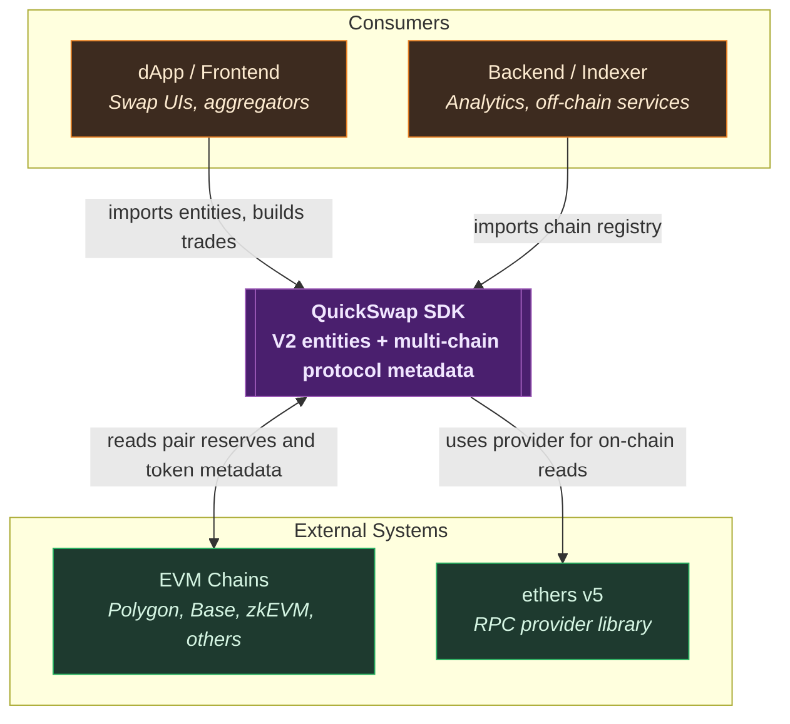

# QuickSwap SDK — Overview

## What

The QuickSwap SDK is a pnpm monorepo that publishes two TypeScript packages for working with
QuickSwap's V2 (Uniswap V2-fork) deployments across multiple EVM chains. `protocol-core` exposes
chain configuration, protocol versions, fees, and token primitives. `sdk` builds on top of it
with the trading entities, fetcher, and router.

## Why

Consumers have very different needs. A frontend that only renders chain names and stablecoin
addresses has no reason to pull in JSBI, ethers, and the V2 math. A swap UI does. Splitting the
project into a base metadata package and a trading SDK keeps each install minimal and lets the
two evolve on independent release cycles.

## Core principle

**One concern per package.** `protocol-core` is pure data and helpers — no on-chain calls, no
math libraries. `sdk` is the V2 trading layer — entities, pricing, and reserve fetching. The
boundary is enforced by the dependency direction: `sdk` depends on `protocol-core`, never the
other way around.

## Packages

| Package | Role | Human analogue |
|---|---|---|
| `@quickswap-defi/protocol-core` | Chain registry, fees, stablecoins, natives | The atlas — knows where things are |
| `@quickswap-defi/sdk` | V2 entities, pair math, trade construction | The calculator — knows what to do with them |

## How they work together

1. **Look up the chain** — pick a chain from the registry, read its protocol versions and tokens.
2. **Build the trade** — use the SDK's `Token`, `Pair`, `Route`, and `Trade` to compute outputs.

Full sequence in [flows/trade-execution.md](./flows/trade-execution.md). Container view in the
root [README](../README.md#architecture).

## Multi-chain support

The chain registry is the single source of truth for which networks the SDK supports and what
their on-chain configuration looks like. See [`packages/protocol-core/`](../packages/protocol-core/)
for the export surface and [glossary.md](./glossary.md) for the underlying concepts (`ChainId`,
`Factory`, `Init Code Hash`).
